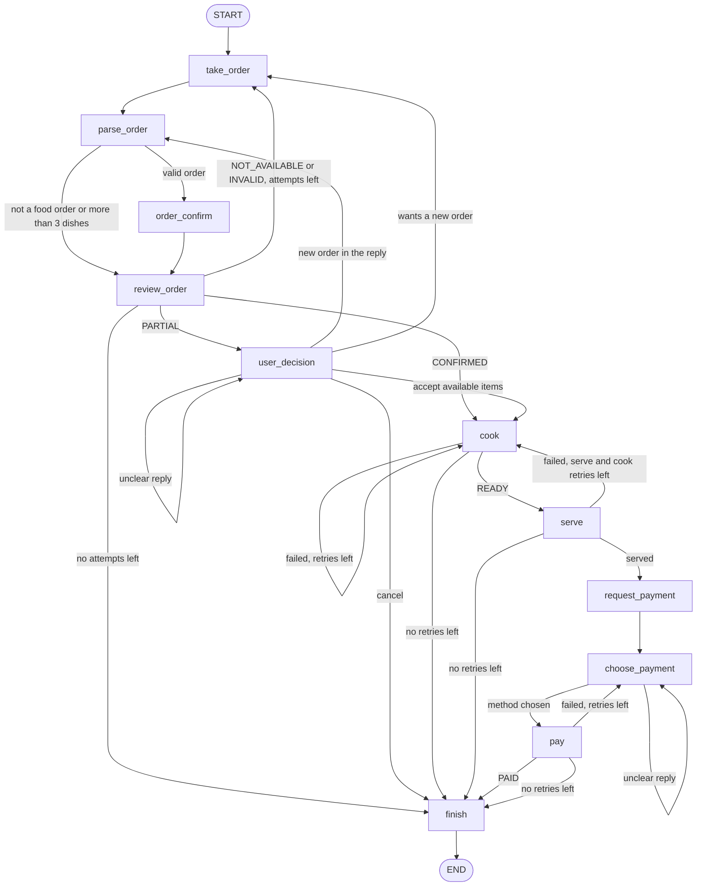

# DineGraph

DineGraph is a restaurant order management agent built with [LangGraph](https://langchain-ai.github.io/langgraph/) and Claude. A customer types an order in plain language. The agent checks it against the menu, handles partial or unavailable orders, sends it to the kitchen, serves it, and takes payment. Every stage has a retry limit, and the agent apologizes when a limit runs out.

The original design notes are in [approch.md](approch.md).

## Features

- **Natural language orders.** Claude turns a message like "two dosas and a cold coffee" into dishes and quantities. It ignores messages that are not food orders.
- **Menu checks.** Each dish is marked fully available, partly available, or unavailable.
- **Partial orders.** The customer can accept what is available, place a new order, or cancel.
- **Simulated kitchen.** Cooking and serving each fail 40% of the time, and failed steps are retried.
- **Payment.** The customer sees an itemized bill and pays by cash, card or UPI.
- **Retry limits.** Orders get 3 attempts, cooking 2, serving 2 and payment 2.
- **HTTP backend.** A FastAPI server exposes the agent, with sessions saved in SQLite.
- **Offline mode.** A rule-based stand-in for Claude runs the whole system without an API key.

## How the graph works



### Nodes

| Node | Uses Claude | What it does |
|---|---|---|
| take_order | No | Pauses the graph until the customer types an order. |
| parse_order | Yes | Extracts dishes and quantities. Rejects non-food messages, more than 3 dishes, and quantities below 1. |
| order_confirm | No | Looks up each dish in the menu and writes its available quantity. A dish not on the menu gets 0. Sets the status to CONFIRMED, PARTIAL or NOT_AVAILABLE. |
| review_order | Yes | Reads the status and tells the customer. An unsuccessful attempt uses up one order retry. |
| user_decision | Yes | Pauses for the customer's reply to a partial order and works out whether they accept, reorder or cancel. |
| cook | No | Cooks the order. It succeeds 60% of the time. Each failure uses up one cook retry. |
| serve | No | Serves the order. It succeeds 60% of the time. Each failure uses up one serve retry and sends the order back to be cooked again. |
| request_payment | Yes | Shows the itemized bill and asks for a payment method. |
| choose_payment | Yes | Pauses for the customer's payment method and works out which one they mean. |
| pay | No | Cash always succeeds. Card and UPI succeed 60% of the time. Each failure uses up one payment retry. |
| finish | Yes | Writes the completion message or an apology and sets the final result. |

Routing between nodes is done in code from the status and the retry counters, so the flow is always predictable. Claude sees the same facts when it writes each message.

### Retry rules

| Stage | Attempts | What happens when they run out |
|---|---|---|
| Order | 3 | The agent apologizes and ends. If the last attempt is partly available, the customer can still accept it or cancel. |
| Cook | 2 | The agent apologizes and ends. A failed serve can only send the order back to cook while cook attempts remain. |
| Serve | 2 | The agent apologizes and ends. |
| Payment | 2 | The agent apologizes and asks the customer to pay at the counter. The order ends as not completed. |

An unclear reply to a partial-order question or a payment question is asked again without using up an attempt.

### State

| Field | Type | Meaning |
|---|---|---|
| messages | list of messages | The conversation between the customer and the agent, merged with LangGraph's `add_messages`. |
| order | list of order items | Up to 3 items, each with dish, required_quantity and available_quantity. |
| status | str | The current stage, listed below. |
| order_retries | int | Starts at 3. |
| cook_retries | int | Starts at 2. |
| serve_retries | int | Starts at 2. |
| payment_retries | int | Starts at 2. |
| payment_method | str | cash, card or upi. Empty until the customer chooses. |
| bill_total | int | The bill total in rupees. |
| final_result | str | COMPLETED, or NOT_COMPLETED with the reason. |

The status moves through these values: NEW, INVALID, PLACED, CONFIRMED, PARTIAL, NOT_AVAILABLE, COOK_FAILED, READY, SERVE_FAILED, COMPLETE, PAYMENT_PENDING, PAYMENT_FAILED, PAID, CANCELLED and FAILED.

An order counts as COMPLETED only when it has been served and paid.

## Project layout

```
dinegraph/
  state.py    LangGraph state, statuses and retry limits
  menu.py     menu quantities and prices
  llm.py      Claude calls and the offline rule-based stand-in
  graph.py    nodes, routing and graph wiring
  main.py     command-line chat
  api.py      FastAPI backend
tests/
  test_scenarios.py   every branch of the graph
  test_api.py         the HTTP backend
approch.md    original design notes
```

## Getting started

You need Python 3.10 or later.

```bash
git clone https://github.com/Adityacrypto-del/DinegGraph.git
cd DinegGraph
python3 -m venv .venv
.venv/bin/pip install -r requirements.txt
export ANTHROPIC_API_KEY=your-key   # skip this to use offline mode
```

### Command-line chat

```bash
.venv/bin/python -m dinegraph.main                      # with Claude
.venv/bin/python -m dinegraph.main --offline --seed 3   # no API key, repeatable kitchen results
```

An example offline session:

```
You: 5 Cold Coffee, 2 Veg Biryani
Assistant: Only part of your order is available: Cold Coffee (asked 5, available 2), ...
You: confirm
  Kitchen: cooking failed (retrying).
  Kitchen: your food is cooked and ready.
  Waiter: your food has been served.
Assistant: Your bill: Cold Coffee x2 = Rs 300; Veg Biryani x2 = Rs 440. Total Rs 740. ...
You: upi
  Cashier: upi payment received.
Assistant: Payment of Rs 740 received by upi. Your order is complete. Enjoy your meal!
```

### Backend

```bash
.venv/bin/uvicorn dinegraph.api:app --reload                      # with Claude
DINEGRAPH_OFFLINE=1 .venv/bin/uvicorn dinegraph.api:app --reload  # no API key
```

Interactive API docs are served at http://localhost:8000/docs.

| Endpoint | What it does |
|---|---|
| `GET /health` | Shows the server is up and which LLM it uses. |
| `GET /menu` | Lists dishes with available quantity and price. |
| `POST /sessions` | Starts a session and returns the welcome message. |
| `GET /sessions/{id}` | Returns messages, status, order, retry counters and bill. |
| `POST /sessions/{id}/messages` | Sends `{"text": "..."}` and runs the graph to its next pause. |
| `POST /sessions/{id}/retry` | Re-runs a step that failed, for example after a Claude error. |

Every session response includes `waiting_for`, which is `order`, `decision`, `payment`, or null when the session has ended. Each message carries a role: user, assistant, kitchen, waiter or cashier.

A quick session with curl:

```bash
SID=$(curl -s -X POST localhost:8000/sessions | python3 -c "import sys,json;print(json.load(sys.stdin)['session_id'])")
curl -s -X POST localhost:8000/sessions/$SID/messages -H 'content-type: application/json' -d '{"text":"2 Masala Dosa"}'
curl -s -X POST localhost:8000/sessions/$SID/messages -H 'content-type: application/json' -d '{"text":"cash"}'
```

| Status code | Meaning |
|---|---|
| 404 | The session does not exist. |
| 409 | The session has finished, or a failed step must be retried first. |
| 422 | The message text is empty or too long. |
| 502 | A Claude call failed. Call the retry endpoint. |
| 503 | No Claude credentials were found. |

### Configuration

| Variable | Purpose | Default |
|---|---|---|
| `ANTHROPIC_API_KEY` | Claude API key. | none |
| `DINEGRAPH_MODEL` | Claude model. | `claude-opus-5` |
| `DINEGRAPH_OFFLINE` | Set to `1` to use the rule-based stand-in in the backend. | off |
| `DINEGRAPH_DB` | SQLite file where backend sessions are saved. | `dinegraph.sqlite` |
| `DINEGRAPH_CORS_ORIGINS` | Frontend origins allowed to call the backend, comma separated. | the Vite dev server |

## Menu

The menu and prices live in [dinegraph/menu.py](dinegraph/menu.py). A dish with quantity 0 is on the menu but sold out.

| Dish | Available | Price (Rs) |
|---|---|---|
| Margherita Pizza | 5 | 350 |
| Paneer Butter Masala | 3 | 280 |
| Veg Biryani | 10 | 220 |
| Chicken Burger | 4 | 180 |
| Pasta Alfredo | 0 | 300 |
| Masala Dosa | 6 | 120 |
| Gulab Jamun | 8 | 90 |
| Cold Coffee | 2 | 150 |

## Tests

```bash
.venv/bin/python -m pytest -q
```

The tests use the offline stand-in and fix the kitchen and payment results in advance, so they need no API key and give the same result on every run. They cover every branch of the graph and every backend endpoint, including restart persistence and recovery from a failed Claude call.

## Roadmap

- A web chat frontend that shows the conversation, the order, the retry counters and the bill.
- Stock that goes down as orders are confirmed.
