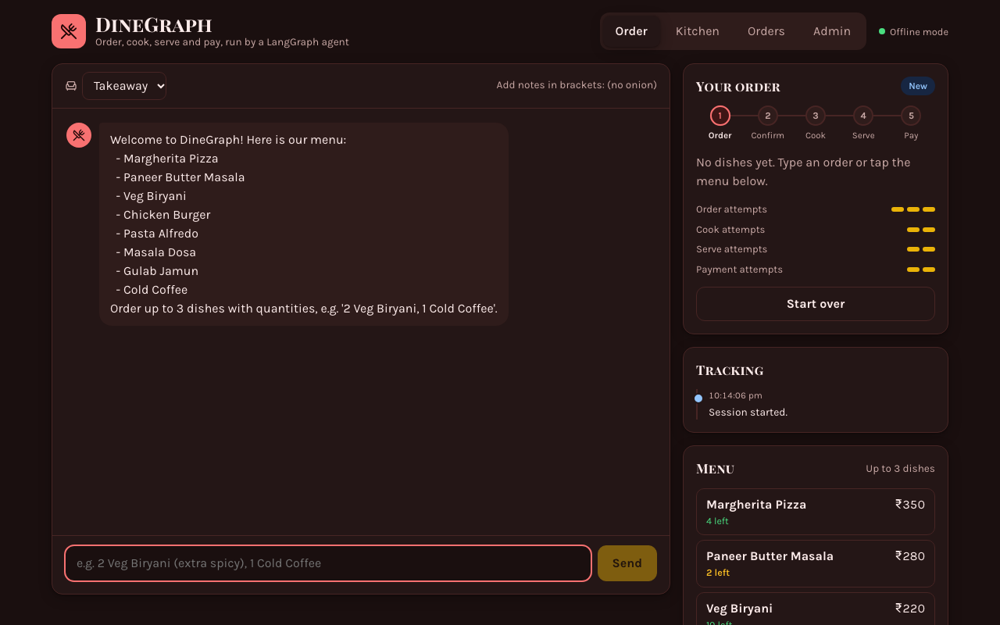
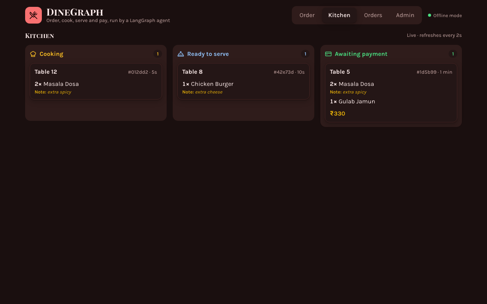
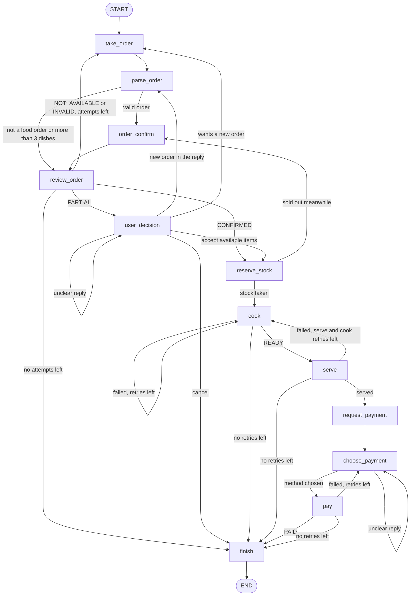

# DineGraph

DineGraph is a restaurant order management agent built with [LangGraph](https://langchain-ai.github.io/langgraph/) and Claude. A customer types an order in plain language. The agent checks it against the menu, handles partial or unavailable orders, sends it to the kitchen, serves it, and takes payment. Every stage has a retry limit, and the agent apologizes when a limit runs out.

It comes with a FastAPI backend, a React web app with a live kitchen screen, and an offline mode that runs everything without an API key. The original design notes are in [approch.md](approch.md).





## Contents

- [Features](#features)
- [Tech stack](#tech-stack)
- [How the graph works](#how-the-graph-works)
- [Project layout](#project-layout)
- [Getting started](#getting-started)
- [Menu](#menu)
- [Tests](#tests)
- [Roadmap](#roadmap)

## Features

- **Natural language orders.** Claude turns a message like "two dosas and a cold coffee" into dishes and quantities. It ignores messages that are not food orders.
- **Menu checks.** Each dish is marked fully available, partly available, or unavailable.
- **Partial orders.** The customer can accept what is available, place a new order, or cancel.
- **Simulated kitchen.** Cooking and serving each fail 40% of the time, and failed steps are retried.
- **Payment.** The customer sees an itemized bill and pays by cash, card or UPI.
- **Retry limits.** Orders get 3 attempts, cooking 2, serving 2 and payment 2.
- **Live stock.** Confirmed orders use up stock, shared by every customer. Orders that are never served put their stock back.
- **HTTP backend.** A FastAPI server exposes the agent, with sessions, the menu and order history saved in SQLite.
- **Tables and dish notes.** Orders can come from a numbered table, and each dish can carry a note such as "extra spicy" or "no onion".
- **Live kitchen screen.** Orders move through cooking, ready to serve and awaiting payment as the graph runs, with a configurable time for each kitchen step.
- **Order tracking.** Every order keeps a timestamped activity log, from seating through cooking, serving, the bill and payment.
- **Staff tools.** Admin endpoints edit the menu and report orders and revenue.
- **Offline mode.** A rule-based stand-in for Claude runs the whole system without an API key.

## Tech stack

| Part | Built with |
|---|---|
| Agent | LangGraph `StateGraph` with `interrupt()` pauses and a SQLite checkpointer |
| Language model | Claude through the Anthropic Python SDK, using structured outputs for parsing and classification |
| Backend | FastAPI and SQLite (WAL mode) for the menu, stock, orders and order events |
| Frontend | React 19, TypeScript and Vite, with Lucide icons |
| Tests | pytest, with a rule-based stand-in for Claude and a fake Anthropic API |

## How the graph works



### Nodes

| Node | Uses Claude | What it does |
|---|---|---|
| take_order | No | Pauses the graph until the customer types an order. |
| parse_order | Yes | Extracts dishes, quantities and any dish notes. Rejects non-food messages, more than 3 dishes, and quantities below 1. |
| order_confirm | No | Looks up each dish in the menu and writes its available quantity. A dish not on the menu gets 0. Sets the status to CONFIRMED, PARTIAL or NOT_AVAILABLE. |
| review_order | Yes | Reads the status and tells the customer. An unsuccessful attempt uses up one order retry. |
| user_decision | Yes | Pauses for the customer's reply to a partial order and works out whether they accept, reorder or cancel. |
| reserve_stock | No | Takes the confirmed order out of stock. If another customer took the stock in the meantime, the order is checked again. |
| cook | No | Cooks the order. It succeeds 60% of the time. Each failure uses up one cook retry. Each attempt takes `DINEGRAPH_KITCHEN_SECONDS` in the backend. |
| serve | No | Serves the order. It succeeds 60% of the time. Each failure uses up one serve retry and sends the order back to be cooked again. Each attempt also takes `DINEGRAPH_KITCHEN_SECONDS`. |
| request_payment | Yes | Shows the itemized bill and asks for a payment method. |
| choose_payment | Yes | Pauses for the customer's payment method and works out which one they mean. |
| pay | No | Cash always succeeds. Card and UPI succeed 60% of the time. Each failure uses up one payment retry. |
| finish | Yes | Writes the completion message or an apology and sets the final result. Puts stock back if the order was never served. |

Routing between nodes is done in code from the status and the retry counters, so the flow is always predictable. Claude sees the same facts when it writes each message.

### Retry rules

| Stage | Attempts | What happens when they run out |
|---|---|---|
| Order | 3 | The agent apologizes and ends. If the last attempt is partly available, the customer can still accept it or cancel. |
| Cook | 2 | The agent apologizes and ends. A failed serve can only send the order back to cook while cook attempts remain. |
| Serve | 2 | The agent apologizes and ends. |
| Payment | 2 | The agent apologizes and asks the customer to pay at the counter. The order ends as not completed. |

An unclear reply to a partial-order question or a payment question is asked again without using up an attempt.

### State

| Field | Type | Meaning |
|---|---|---|
| messages | list of messages | The conversation between the customer and the agent, merged with LangGraph's `add_messages`. |
| order | list of order items | Up to 3 items, each with dish, required_quantity, available_quantity and an optional note. |
| status | str | The current stage, listed below. |
| order_retries | int | Starts at 3. |
| cook_retries | int | Starts at 2. |
| serve_retries | int | Starts at 2. |
| payment_retries | int | Starts at 2. |
| payment_method | str | cash, card or upi. Empty until the customer chooses. |
| bill_total | int | The bill total in rupees. |
| stock_reserved | bool | True while the order holds stock. |
| final_result | str | COMPLETED, or NOT_COMPLETED with the reason. |
| table | int or null | The table number, or null for a takeaway order. |

The status moves through these values: NEW, INVALID, PLACED, CONFIRMED, PARTIAL, NOT_AVAILABLE, COOK_FAILED, READY, SERVE_FAILED, COMPLETE, PAYMENT_PENDING, PAYMENT_FAILED, PAID, CANCELLED and FAILED.

An order counts as COMPLETED only when it has been served and paid.

## Project layout

```
dinegraph/
  state.py    LangGraph state, statuses and retry limits
  menu.py     menu quantities and prices
  llm.py      Claude calls and the offline rule-based stand-in
  graph.py    nodes, routing and graph wiring
  inventory.py  stock interface and the in-memory version used by the command line
  store.py    SQLite menu, stock, order records and order events for the backend
  main.py     command-line chat
  api.py      FastAPI backend
frontend/     React + Vite web app (order chat, kitchen screen, order history, admin)
  src/api.ts          typed client for the backend
  src/components/     OrderView, OrderPanel, KitchenView, OrdersView, AdminView
design-system/dinegraph/MASTER.md   colours, fonts and UI rules the frontend follows
tests/
  test_scenarios.py   every branch of the graph
  test_api.py         the HTTP backend
  test_claude_wiring.py  the Claude calls, against a fake API
scripts/
  live_check.py       checks against the real Claude API
docs/         screenshots used in this README
approch.md    original design notes
```

The repository also carries tooling for AI-assisted development. `graphify-out/` is a knowledge graph of the code built with [graphify](https://github.com/Graphify-Labs/graphify); refresh it with `graphify update .` after changing code. `.claude/skills/` holds the graphify and ui-ux-pro-max skills for Claude Code.

## Getting started

You need Python 3.10 or later.

```bash
git clone https://github.com/Adityacrypto-del/DineGraph.git
cd DineGraph
python3 -m venv .venv
.venv/bin/pip install -r requirements.txt
export ANTHROPIC_API_KEY=your-key   # skip this to use offline mode
```

### Command-line chat

```bash
.venv/bin/python -m dinegraph.main                      # with Claude
.venv/bin/python -m dinegraph.main --offline --seed 3   # no API key, repeatable kitchen results
```

An example offline session:

```
You: 5 Cold Coffee, 2 Veg Biryani
Assistant: Only part of your order is available: Cold Coffee (asked 5, available 2), ...
You: confirm
  Kitchen: cooking failed (retrying).
  Kitchen: your food is cooked and ready.
  Waiter: your food has been served.
Assistant: Your bill: Cold Coffee x2 = Rs 300; Veg Biryani x2 = Rs 440. Total Rs 740. ...
You: upi
  Cashier: upi payment received.
Assistant: Payment of Rs 740 received by upi. Your order is complete. Enjoy your meal!
```

### Backend

```bash
.venv/bin/uvicorn dinegraph.api:app --reload                      # with Claude
DINEGRAPH_OFFLINE=1 .venv/bin/uvicorn dinegraph.api:app --reload  # no API key
```

Interactive API docs are served at http://localhost:8000/docs.

| Endpoint | What it does |
|---|---|
| `GET /health` | Shows the server is up and which LLM it uses. |
| `GET /menu` | Lists dishes with available quantity and price. |
| `POST /sessions` | Starts a session and returns the welcome message. Send `{"table": 7}` to seat it at a table. |
| `GET /sessions/{id}` | Returns messages, status, order, retry counters, bill, table and whether the graph is still running. |
| `POST /sessions/{id}/messages` | Sends `{"text": "..."}` and runs the graph to its next pause. `?wait=1` answers after one second with `busy: true` if the graph is still running. |
| `POST /sessions/{id}/retry` | Re-runs a step that failed, for example after a Claude error. Takes `?wait` too. |
| `GET /orders` | Lists orders, newest first. Filter with `?status=PAID` and page with `limit` and `offset`. |
| `GET /orders/{id}` | One order: items, status, result, bill, payment method and table. |
| `GET /orders/{id}/events` | The order's activity log, oldest first. |
| `GET /kitchen` | Open orders the kitchen is cooking, the waiters are serving, or that are waiting for payment. |
| `PUT /admin/menu/{dish}` | Adds a dish, or changes its stock or price. A new dish needs both `quantity` and `price`. |
| `DELETE /admin/menu/{dish}` | Removes a dish from the menu. |
| `GET /admin/stats` | Counts of completed, failed, cancelled and in-progress orders, plus revenue by payment method. |

If `DINEGRAPH_ADMIN_TOKEN` is set, the admin endpoints need the header `X-Admin-Token` with that value. Without it they are open, which suits local development.

Every session response includes `waiting_for`, which is `order`, `decision`, `payment`, or null when the session has ended. Each message carries a role: user, assistant, kitchen, waiter or cashier.

Dish notes go in brackets after the dish, for example `2 Masala Dosa (extra spicy), 1 Cold Coffee`. With Claude, notes can also be written in plain words.

The graph runs in a background thread and saves the order record after every step, which is how the kitchen screen and tracking stay live. A request waits up to `DINEGRAPH_WAIT_SECONDS`, or its own `?wait=`, for the graph to pause. If the graph is still running, the response has `busy: true`, and the client polls `GET /sessions/{id}` until it is false. Busy sessions are tracked in memory, so run a single server process.

A quick session with curl:

```bash
SID=$(curl -s -X POST localhost:8000/sessions | python3 -c "import sys,json;print(json.load(sys.stdin)['session_id'])")
curl -s -X POST localhost:8000/sessions/$SID/messages -H 'content-type: application/json' -d '{"text":"2 Masala Dosa"}'
curl -s -X POST localhost:8000/sessions/$SID/messages -H 'content-type: application/json' -d '{"text":"cash"}'
```

| Status code | Meaning |
|---|---|
| 401 | An admin endpoint was called without the right token. |
| 404 | The session, order or dish does not exist. |
| 409 | The session has finished, is still busy, or has a failed step that must be retried first. |
| 422 | The request body is invalid, for example empty text or negative stock. |
| 502 | A Claude call failed. Call the retry endpoint. |
| 503 | No Claude credentials were found. |

### Web frontend

The web app lives in `frontend/`. It needs Node 20 or newer.

```bash
# terminal 1: the backend
DINEGRAPH_OFFLINE=1 uvicorn dinegraph.api:app --port 8000

# terminal 2: the frontend
cd frontend
npm install
npm run dev            # http://localhost:5173
```

The dev server forwards `/api/*` to the backend, so the browser talks to one origin. Set `DINEGRAPH_API` to use a backend on another address, for example `DINEGRAPH_API=http://127.0.0.1:8765 npm run dev`. For a production build, run `npm run build` and set `VITE_API_URL` to the backend's public URL.

The app has four tabs. Each has its own URL hash, so a kitchen display can open `http://localhost:5173/#kitchen` directly.

| Tab | What it shows |
|---|---|
| Order | The chat with the agent, a table picker, quick replies for the partial-order and payment questions, a progress bar for order, confirm, cook, serve and pay, the current order with dish notes, the retry counters, the bill, a live tracking timeline and the menu. Tapping a dish adds it to the message. The session survives a page reload. |
| Kitchen | A live board, refreshed every 2 seconds, with columns for cooking, ready to serve and awaiting payment. Each ticket shows the table, the dishes with their notes, and how long ago the order came in. |
| Orders | Every order with its table, items and notes, total, payment method, status and result, filterable by status. |
| Admin | Revenue and order stats, and a menu editor to change stock and prices, add dishes or remove them. Enter `DINEGRAPH_ADMIN_TOKEN` here if the backend sets one. |

The visual design comes from `design-system/dinegraph/MASTER.md`, generated with the ui-ux-pro-max skill. It uses an appetizing red with a warm gold call to action, Playfair Display SC headings and Karla body text, Lucide icons, light and dark themes, 44px touch targets, visible focus rings and reduced motion support.

### Configuration

| Variable | Purpose | Default |
|---|---|---|
| `ANTHROPIC_API_KEY` | Claude API key. | none |
| `DINEGRAPH_MODEL` | Claude model. | `claude-opus-5` |
| `DINEGRAPH_OFFLINE` | Set to `1` to use the rule-based stand-in in the backend. | off |
| `DINEGRAPH_DB` | SQLite file where backend sessions are saved. | `dinegraph.sqlite` |
| `DINEGRAPH_ADMIN_TOKEN` | Token required by the admin endpoints. | none, admin is open |
| `DINEGRAPH_CORS_ORIGINS` | Frontend origins allowed to call the backend, comma separated. | the Vite dev server |
| `DINEGRAPH_KITCHEN_SECONDS` | Seconds each cook and serve attempt takes. Try `4` to watch orders move on the kitchen screen. | `0` |
| `DINEGRAPH_WAIT_SECONDS` | How long a request waits for the graph to pause before it answers with `busy: true`. | `15` |

## Menu

The starting menu and prices live in [dinegraph/menu.py](dinegraph/menu.py). A dish with quantity 0 is on the menu but sold out. The backend copies this menu into its database the first time it starts. After that, change the menu through the admin endpoints.

| Dish | Available | Price (Rs) |
|---|---|---|
| Margherita Pizza | 5 | 350 |
| Paneer Butter Masala | 3 | 280 |
| Veg Biryani | 10 | 220 |
| Chicken Burger | 4 | 180 |
| Pasta Alfredo | 0 | 300 |
| Masala Dosa | 6 | 120 |
| Gulab Jamun | 8 | 90 |
| Cold Coffee | 2 | 150 |

## Tests

```bash
.venv/bin/python -m pytest -q
```

### Live check with Claude

The normal tests never call Claude. `tests/test_claude_wiring.py` runs the real Claude code against a fake API to check the requests it sends and how it handles replies, including refusals. To check the real model, set your key and run the live script. It sends about 15 short requests and prints one line per check.

```bash
export ANTHROPIC_API_KEY=sk-ant-...
python scripts/live_check.py
```

The tests use the offline stand-in and fix the kitchen and payment results in advance, so they need no API key and give the same result on every run. They cover every branch of the graph and every backend endpoint, including stock sharing between customers, restart persistence, recovery from a failed Claude call, tables and dish notes, the order activity log, and the kitchen screen following a slow kitchen.

## Roadmap

- **Production deploy.** Postgres alongside SQLite, Docker images for the backend and frontend, a Docker Compose setup, and a hosted deployment.
- **Live Claude run.** Run `scripts/live_check.py` with a real API key to confirm the Claude path end to end, including dish notes.
